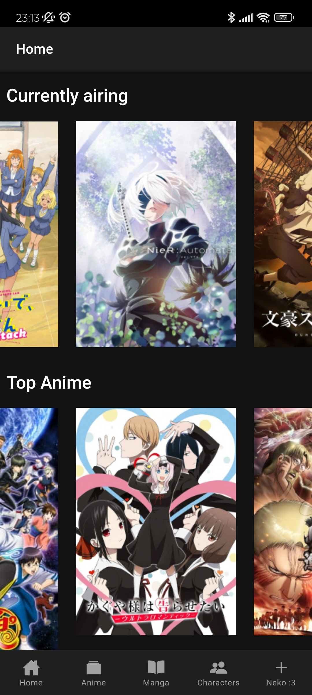
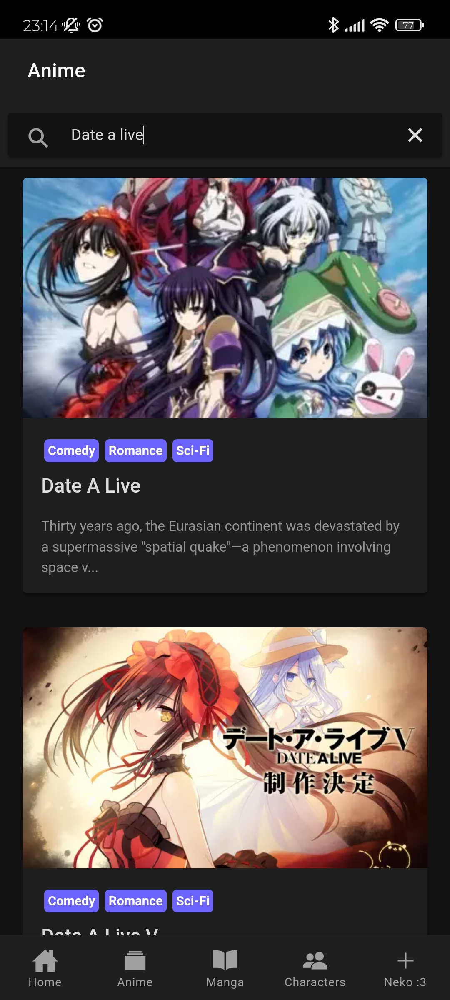
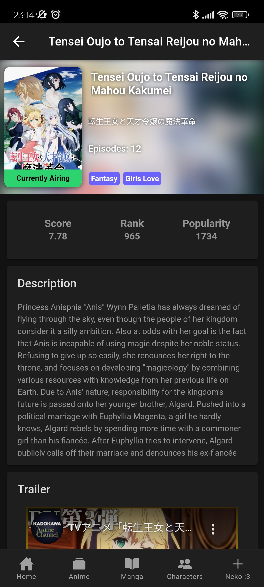
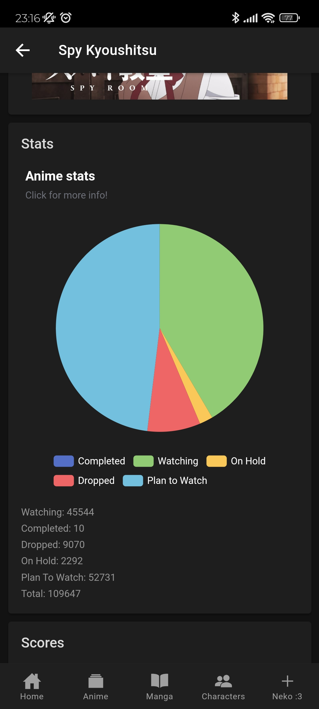
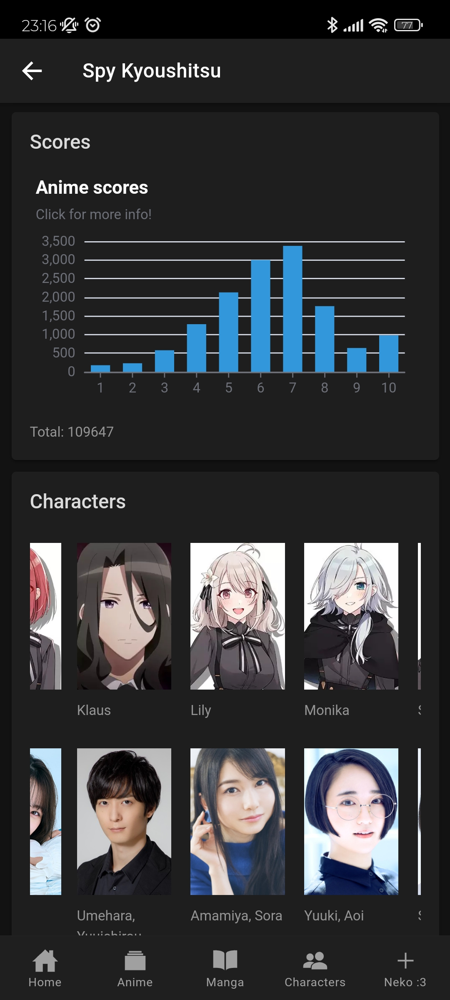
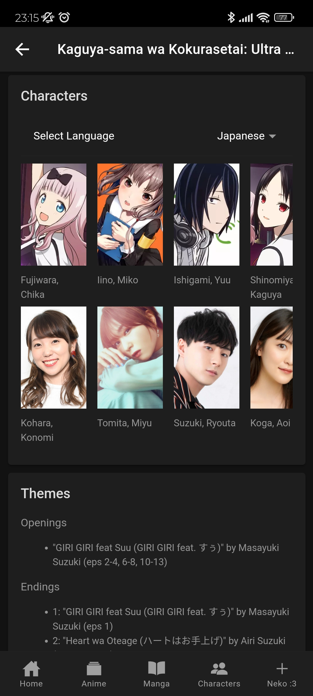

# Anime Chan

This is a wip Ionic-Angular project to search and view Anime and Manga info from MyAnimeList using Marika (Jikan API).

## Home page

## Search page

## Info page

## Anime stats

## Characters

